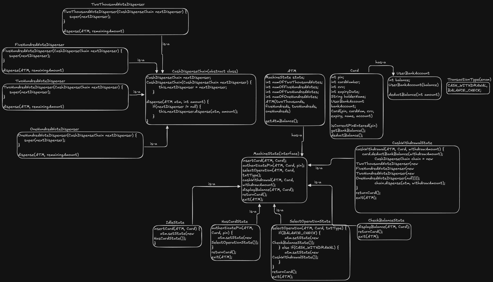

# ATM Low-Level Design (LLD)

A robust object-oriented simulation of an Automated Teller Machine (ATM) implemented in Java. This project demonstrates the practical application of **State** and **Chain of Responsibility** design patterns to handle complex state transitions and dynamic cash dispensing logic.

## Architecture

The system is designed to be modular and scalable, separating the ATM's internal states from the cash dispensing logic.



## Key Design Patterns

### 1. State Design Pattern
Used to manage the internal lifecycle of the ATM. The ATM object delegates user actions to its current state, ensuring that invalid operations (e.g., withdrawing cash before inserting a card) are impossible.
* **IdleState**: Waiting for a card.
* **HasCardState**: Authenticating PIN.
* **SelectOperationState**: Choosing between Withdrawal or Balance Check.
* **CashWithdrawalState**: Validating funds and triggering the dispenser.

### 2. Chain of Responsibility Pattern
Used for the cash dispensing algorithm. The request to withdraw a specific amount is passed down a chain of handlers, where each handler dispenses its specific note denomination and passes the remainder to the next.
* **Chain Order**: `TwoThousand` -> `FiveHundred` -> `TwoHundred` -> `OneHundred`.

## Project Structure

```text
ATM/
├── dispenser/              # Chain of Responsibility Logic
│   ├── CashDispenseChain.java
│   └── [Note]Dispenser.java
├── models/                 # Core Entities
│   ├── ATM.java           # The Context Class
│   ├── Card.java
│   ├── UserBankAccount.java
│   └── TransactionType.java
├── state/                  # State Pattern Logic
│   ├── MachineState.java  # State Interface
│   └── [StateName].java
└── Main.java               # Entry point / Simulation
```

## How It Works

1.  **Initialization**: The ATM is loaded with a specific count of notes (2000s, 500s, 200s, 100s).
2.  **Authentication**: User inserts card and enters PIN (validated against `Card` object).
3.  **Transaction**:
    * **Balance Check**: Fetches balance directly from the `UserBankAccount`.
    * **Withdrawal**:
        1.  Checks ATM balance.
        2.  Checks User account balance.
        3.  Deducts amount from User.
        4.  Calculates the optimal note combination using the **Dispenser Chain**.

## Usage Example

```java
// 1. Initialize ATM with notes (5x2000, 8x500, etc.)
ATM atm = new ATM(5, 8, 15, 20);

// 2. Create User
UserBankAccount account = new UserBankAccount(50000);
Card card = new Card(1564, 12345678, 519, 2028, "Satyam", account);

// 3. Perform Transaction
atm.getState().insertCard(atm, card);
atm.getState().authenticatePin(atm, card, 1564);
atm.getState().selectOperation(atm, card, TransactionType.CASH_WITHDRAWAL);
atm.getState().cashWithdrawal(atm, card, 5000);
```

### Console Output
```text
ATM balance: 19000
Card is inserted
PIN entered is correct
Please collect your cash
Updated ATM balance: 14000
```