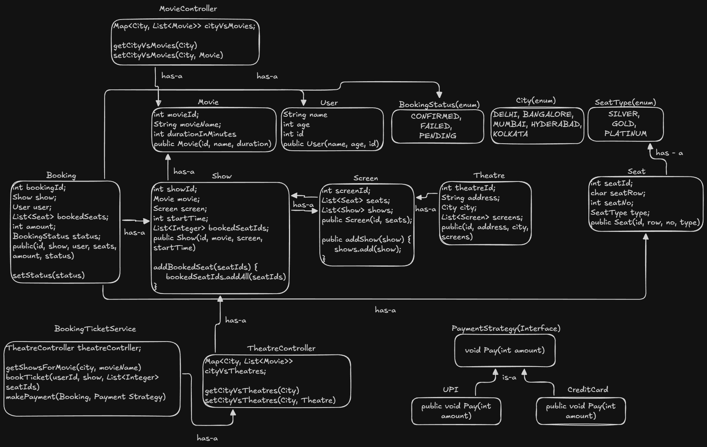

# BookMyShow - Low Level Design (LLD)

A robust, console-based backend prototype for a movie ticket booking system, designed to simulate a real-world machine coding interview scenario. This project demonstrates core Object-Oriented Design principles, Design Patterns, and clean architecture.

## Features

* **City-Based Search:** Browse theatres and shows available in specific cities (e.g., Delhi, Bangalore).
* **Drill-Down Hierarchy:** Handles complex relationships: `Theatre` → `Screen` → `Show` → `Seat`.
* **Booking Lifecycle:** Manages booking states from **PENDING** to **CONFIRMED**.
* **Concurrency Handling:** Implements **Pessimistic Locking** (Simulated) to prevent double-booking of seats.
* **Pluggable Payments:** Uses the **Strategy Design Pattern** to support multiple payment methods (UPI, Credit Card) without modifying core logic.

## 🏗️ Architecture Diagram


*(A visual representation of the Class relationships, Models, and Services)*

## Tech Stack & Design Patterns

* **Language:** Java (JDK 8+)
* **Architecture:** MVC (Model-View-Controller) separation.
* **Design Patterns:**
    * **Strategy Pattern:** For decoupled payment processing.
    * **Service Layer Pattern:** Separating business logic from data access.
    * **Repository/Controller Pattern:** Simulating in-memory database operations.

## 📂 Project Structure

```text
BookMyShow/
├── controllers/              # Handles data fetching (TheatreController)
├── docs/                     # Architecture & UML Diagrams
├── enums/                    # Constants (City, BookingStatus, SeatType)
├── models/                   # Entities (Theatre, Screen, Show, Seat, Booking)
├── services/                 # Core Business Logic (BookTicketService)
├── strategies/               # Payment Algorithms (PaymentStrategy, UpiPaymentService)
├── Main.java                 # Entry point (User Journey Simulation)
└── README.md                 # Project Documentation
```