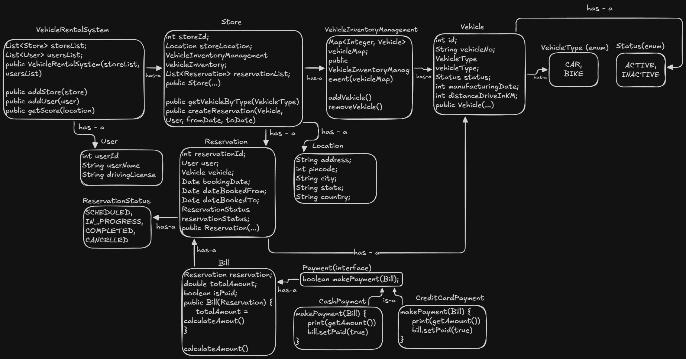

# Vehicle Rental System (Low-Level Design)

A Java-based Low-Level Design (LLD) implementation of a vehicle rental service (similar to Zoomcar or Uber Rentals). This project demonstrates core Object-Oriented Design principles, proper separation of concerns, and the use of Design Patterns to solve common business problems.

## 📂 Project Structure

The project is organized into modular packages to ensure scalability and maintainability:

```text
CarRentalSystem/
├── docs/                # Architecture diagrams and design documents
├── enums/               # Enumerations (VehicleType, Status, ReservationStatus)
├── models/              # Domain entities (Vehicle, User, Store, Bill, Location)
├── payment/             # Payment logic implementing Strategy Pattern
├── service/             # Core business logic (Inventory Management, System)
└── Main.java            # Entry point / Simulation of the user journey
```



## 🚀 Key Features

* **Vehicle Inventory Management:** Scalable management of vehicle assets using a dedicated inventory system.
* **Store Management:** Each store tracks its own inventory and reservations independently.
* **Reservation System:**
    * Prevents double-booking through logic that checks date overlaps.
    * Auto-generates unique reservation IDs.
* **Dynamic Billing:** Calculates rental costs based on booking duration (millis to days conversion) with rounding logic.
* **Flexible Payments:** Supports multiple payment modes via the Strategy Design Pattern.

## 🛠 Design Patterns & Principles Used

### 1. Strategy Pattern (Payments)
* **Why:** To allow new payment methods to be added without modifying existing code (Open/Closed Principle).
* **Implementation:** `PaymentMode` interface is implemented by `CashPayment` and `CreditCardPayment`.

### 2. Single Responsibility Principle (SRP)
* **VehicleInventoryManagement:** Separated from the `Store` class. The Store manages operations, while the Inventory Manager handles asset storage and retrieval.
* **Bill:** The billing logic is decoupled from the `Reservation` class to allow for complex tax/penalty calculations in the future without bloating the reservation logic.

### 3. Delegation
* The `Store` class delegates vehicle search operations to the `VehicleInventoryManagement` class rather than handling the data filtering itself.

## 📸 Architecture

The high-level class design and relationships can be viewed in the documentation folder:
`docs/CarRentalSystem_LLD_Architecture.png`

## 💻 How to Run

1.  **Clone the repository**
    ```bash
    git clone [https://github.com/mishra-satyam531/LLD-Java.git](https://github.com/mishra-satyam531/LLD-Java.git)
    ```

2.  **Open in IDE**
    Open the project in IntelliJ IDEA, Eclipse, or VS Code. Ensure your IDE detects the package structure.

3.  **Run the Simulation**
    Navigate to `CarRentalSystem/Main.java` and run the file. It will simulate a full user journey:
    1.  **Setup:** Creates stores, vehicles (Honda City, Hyundai Creta), and users.
    2.  **Search:** User searches for available cars.
    3.  **Booking:** User books a vehicle for a 3-day duration.
    4.  **Payment:** System generates a bill and processes payment via Cash.

## 🔮 Future Improvements

* **Concurrency Handling:** Implement synchronization locks to handle multiple users trying to book the same vehicle simultaneously.
* **Database Integration:** Replace in-memory `Map` and `List` structures with a persistent database (SQL/NoSQL).
* **Notification Service:** Add an Observer Pattern to notify users via Email/SMS upon booking confirmation.

---
*Author: Satyam Mishra*