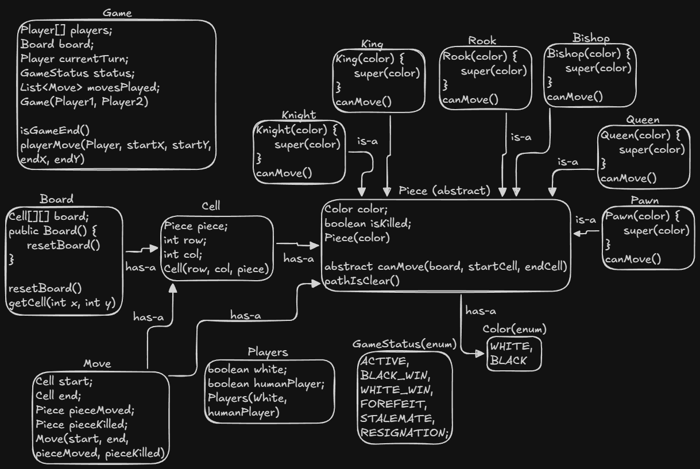

# Chess Game Low-Level Design (LLD)

A robust object-oriented simulation of a Chess engine implemented in Java. This project demonstrates the practical application of **Polymorphism** and the **Command Pattern** to handle complex movement validation and game state management without tight coupling.

## Architecture

The system is designed with strict separation between the "Game Controller" (logic flow), the "Board" (state storage), and the "Pieces" (movement physics).



## Key Design Patterns & Principles

### 1. Command Pattern (via Move Class)
Used to encapsulate a player's action as an object. Every valid turn creates a `Move` object that stores the state of the board *before* the change (start/end cells) and the result of the action (moved piece, captured piece).
* **Benefit**: Decouples the execution of a move from the request, enabling history tracking and future "Undo/Redo" features.

### 2. Polymorphism (Strategy-like Behavior)
Used to eliminate complex `if/else` chains in the Game controller. The `Game` class does not know how pieces move; it simply calls `piece.canMove()`. The specific logic is delegated to the concrete classes.
* **Knight**: Validates L-Shape math (`dx * dy == 2`).
* **Sliding Pieces**: Delegate to the shared `pathIsClear()` logic in the parent class.

## Project Structure

```text
Chess/
├── models/                 # Core Entities & State
│   ├── Board.java          # The 8x8 Grid Container
│   ├── Cell.java           # Unit of the board (Row, Col, Piece)
│   ├── Move.java           # Command Object (History log)
│   ├── Piece.java          # Abstract Base Class (Shared Physics)
│   ├── Player.java         # Actor details (White/Black side)
│   ├── GameStatus.java     # Enum (ACTIVE, WHITE_WIN, etc.)
│   └── Color.java          # Enum (WHITE, BLACK)
├── pieces/                 # Polymorphic Logic
│   ├── King.java
│   ├── Knight.java
│   ├── Pawn.java
│   ├── Bishop.java
│   ├── Rook.java
│   └── Queen.java
├── Game.java               # Controller: Turn management & Validation
└── Main.java               # Entry point / Simulation
```

## How It Works

1.  **Initialization**: The `Game` initializes the `Board` and creates two `Player` objects (White and Black).
2.  **Request**: The Controller (`Game`) receives a request: "Move (6,4) to (4,4)".
3.  **Validation**:
    * **Ownership**: Is it the correct player's turn?
    * **Physics**: Calls `sourcePiece.canMove()` to verify geometry and collisions.
4.  **Execution**:
    * Updates `Cell` references (Target receives piece, Source becomes null).
    * Records the transaction in the `movesPlayed` list.
    * Switches `currentTurn` to the opponent.

## Usage Example

```java
// 1. Initialize Players
Player p1 = new Player(true, true);   // White (Satyam)
Player p2 = new Player(false, true);  // Black (Opponent)

// 2. Start Game
Game game = new Game(p1, p2);
game.initializeTestBoard(); // Loads pieces for simulation

// 3. Perform Moves
// White Pawn moves e2 -> e4
game.playerMove(p1, 6, 4, 4, 4); 

// Black Pawn moves e7 -> e5
game.playerMove(p2, 1, 4, 3, 4);

// White Knight moves g1 -> f3
game.playerMove(p1, 7, 6, 5, 5);
```

### Console Output
```text
1. White attempts: Pawn e2 -> e4
   Result: SUCCESS

2. Black attempts: Pawn e7 -> e5
   Result: SUCCESS

3. White attempts: Knight g1 -> f3
   Result: SUCCESS

4. Black Bishop tries to jump: f8 -> c5
   Result: BLOCKED (As Expected)
```