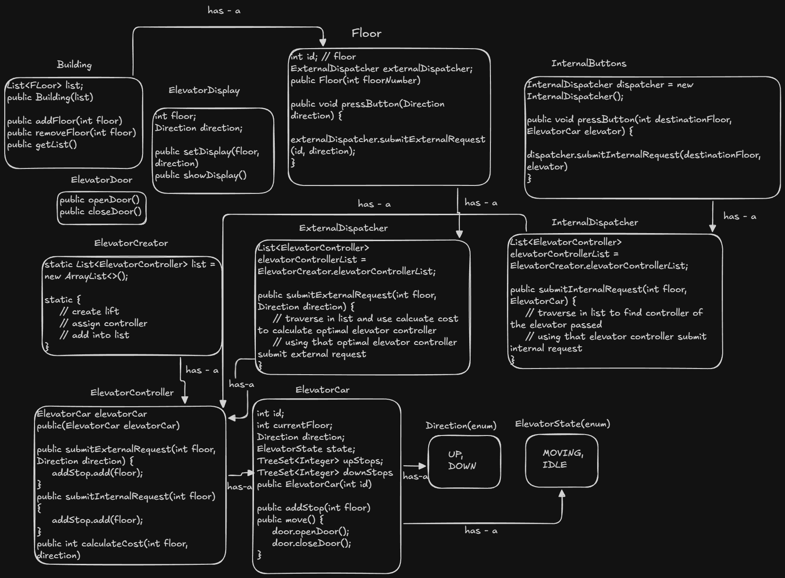

# Elevator System

A low-level design implementation of a smart Elevator System in Java, complying with SOLID principles and standard design patterns.

## Problem Statement

Design a controller and dispatching logic for an elevator system that can handle internal and external requests efficiently. The system should prioritize requests based on the direction of the elevator and prevent starvation using an optimal scheduling algorithm.

## System Architecture

## 🏗 System Architecture

The system follows a decoupled architecture separating the **decision-making logic** (Dispatchers) from the **execution logic** (Controllers/Cars).



**Key Features:**
* **LOOK Algorithm:** Used for elevator scheduling (similar to SCAN but changes direction dynamically) to minimize wait time.
* **Cost-Based Dispatching:** The `ExternalDispatcher` calculates the physical cost (distance + direction penalty) to assign the most optimal elevator.
* **Thread-Safe Registry:** Centralized `ElevatorCreator` to manage system components.

## Class Structure

* **ElevatorCar**: Represents the physical elevator. Stores stops in `TreeSet` (Up/Down queues) and manages state (`IDLE`, `MOVING`).
* **ElevatorController**: Manages a single elevator instance. Calculates traversal cost but delegates global decision-making to the dispatcher.
* **ExternalDispatcher**: Handles requests from floors (`UP`/`DOWN`). Iterates through all controllers to find the one with the minimum cost.
* **InternalDispatcher**: Routes requests from inside the elevator panel to the respective controller.
* **ElevatorCreator**: A registry class that initializes elevators and controllers on startup.
* **Building/Floor**: Represents the physical infrastructure.

## Design Patterns Used

1.  **Single Responsibility Principle (SRP):**
    * `ElevatorCar` handles movement.
    * `ElevatorController` handles cost calculation.
    * `ExternalDispatcher` handles assignment logic.
2.  **Strategy Pattern:** The cost calculation logic allows swapping different dispatching strategies.
3.  **Observer Pattern:** `ElevatorDisplay` observes and updates based on `ElevatorCar` state.
4.  **Singleton Pattern (Variation):** `ElevatorCreator` acts as a static registry for global access.

## File Structure

The project is organized into logical packages for better maintainability:

```text
ElevatorSystem/
├── controllers/          # Handles individual elevator management
│   └── ElevatorController.java
├── dispatchers/          # Handles request routing and decision making
│   ├── ExternalDispatcher.java
│   └── InternalDispatcher.java
├── docs/                 # Documentation and architecture diagrams
│   └── ElevatorSystem_LLD_Architecture.png
├── enums/                # Enumerations for state and direction
│   ├── Direction.java
│   └── ElevatorState.java
├── models/               # Core entities and peripherals
│   ├── Building.java
│   ├── ElevatorCar.java
│   ├── ElevatorDisplay.java
│   ├── ElevatorDoor.java
│   ├── Floor.java
│   └── InternalButtons.java
├── registry/             # System initialization and lookup
│   └── ElevatorCreator.java
└── Main.java             # Entry point and simulation