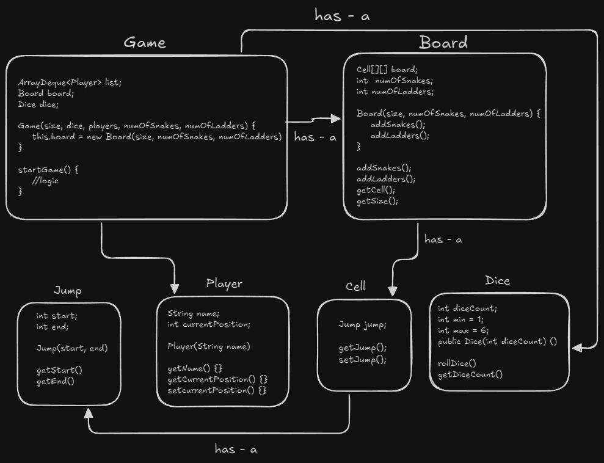

# Snake and Ladder Game - Low Level Design (LLD)

A fully functional, console-based implementation of the classic Snake and Ladder game in Java. This project demonstrates strong Object-Oriented Design principles, focusing on modularity, readability, and the "Separation of Concerns."



## Features
- **Dynamic Board Size:** The board size is configurable (e.g., 10x10).
- **Randomized Elements:** Snakes and Ladders are generated randomly at runtime using `ThreadLocalRandom` for better distribution.
- **Scalable Dice:** Support for single or multiple dice configurations.
- **Multi-Player Support:** Designed using a `Deque` to handle player turns efficiently.
- **Clean Architecture:** Strictly follows OOPS principles (Encapsulation, Composition).

## Project Structure

The project is structured to separate data models from game logic:

```text
SnakeAndLadder/
├── models/
│   ├── Board.java      # Manages the grid and placement of jumps
│   ├── Cell.java       # Represents a single square on the board
│   ├── Dice.java       # Handles random number generation
│   ├── Jump.java       # Represents Snakes (start > end) and Ladders (end > start)
│   └── Player.java     # Holds player details and current position
├── Game.java           # The Controller: Manages flow, turns, and win conditions
└── Main.java           # Entry point: Initializes objects and starts the game