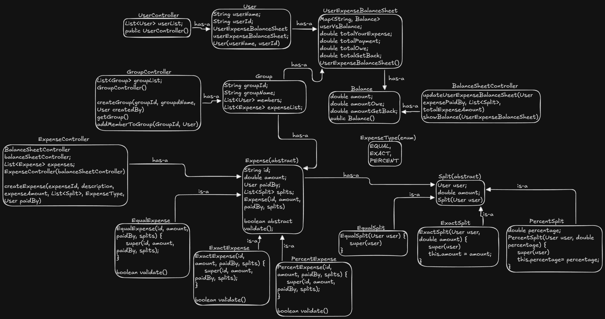

# Splitwise Low-Level Design (LLD)

A robust object-oriented simulation of an expense sharing application implemented in Java. This project demonstrates the practical application of **MVC Architecture**, **Strategy Pattern**, and **Factory Pattern** to handle complex expense splitting and double-entry bookkeeping without tight coupling.

## Architecture

The system is designed using the **Model-View-Controller (MVC)** pattern to strictly separate the "Business Logic" (Controllers), the "Data" (Models), and the "Orchestration" (Driver).



## Key Design Patterns & Principles

### 1. MVC Pattern (Separation of Concerns)
Used to organize code into logical layers.
* **Models (`User`, `Group`)**: "Dumb" containers that only hold data.
* **Controllers (`ExpenseController`, `BalanceSheetController`)**: The "Brains" that handle logic, validation, and updates.
* **View/Driver (`Splitwise.java`)**: The entry point that delegates tasks to controllers.

### 2. Strategy Pattern (Expense Types)
Used to eliminate complex `if/else` chains validation logic. The `Expense` class is abstract, and specific validation logic is delegated to concrete classes:
* **EqualExpense**: Automatically splits amounts equally.
* **PercentExpense**: Validates that percentages sum to 100%.
* **ExactExpense**: Validates that individual amounts sum to the total.

### 3. Factory Pattern (Object Creation)
Used in the `ExpenseController` to encapsulate the creation logic. The client simply requests an `ExpenseType.EQUAL` expense, and the factory handles the instantiation of the correct object and the calculation of shares.

## Project Structure

```text
SplitwiseProject/
└── Splitwise/
    ├── Main.java                   # Entry Point (contains main method)
    ├── Splitwise.java              # Driver/Orchestrator (Simulation Flow)
    │
    ├── Controllers/                # The Logic Layer (The "Brains")
    │   ├── BalanceSheetController.java
    │   ├── ExpenseController.java
    │   ├── GroupController.java
    │   └── UserController.java
    │
    ├── Models/                     # The Data Layer (Entities)
    │   ├── Balance.java            # Value Object (Amount, Owe, GetBack)
    │   ├── Group.java              # Container for Users and Expenses
    │   ├── User.java               # Entity holding ID, Name, and Ledger
    │   └── UserExpenseBalanceSheet.java # The Ledger Map
    │
    ├── Enums/
    │   └── ExpenseType.java        # Enum (EQUAL, EXACT, PERCENT)
    │
    ├── Expense/                    # Strategy Pattern (Expense Hierarchy)
    │   ├── Expense.java            # Abstract Base Class
    │   ├── EqualExpense.java
    │   ├── ExactExpense.java
    │   └── PercentExpense.java
    │
    └── Split/                      # Split Logic
        ├── Split.java              # Abstract Base Class
        ├── EqualSplit.java
        ├── ExactSplit.java
        └── PercentSplit.java
```

## How It Works

1.  **Initialization**: The `Splitwise` driver initializes all Controllers (`User`, `Group`, `Expense`, `BalanceSheet`).
2.  **Onboarding**: Users are added to the system via `UserController`.
3.  **Grouping**: Users are added to a `Group` via `GroupController`.
4.  **Expense Creation**:
    * **Request**: `ExpenseController` receives a request (e.g., "User1 pays $300, Split Equally").
    * **Factory Logic**: Calculates shares ($150 each) and creates an `EqualExpense`.
    * **Ledger Update**: Calls `BalanceSheetController` to perform **Double-Entry Bookkeeping** (updates both the Payer's and the Borrower's balance sheets).

## Usage Example

```java
// 1. Initialize System
Splitwise splitwise = new Splitwise();

// 2. Setup Users & Groups (Internally handles Controller calls)
splitwise.setupUserAndGroup(); 
// Creates User1, User2
// Creates Group "Goa Trip"

// 3. Perform Expense (Simulation)
// User1 pays $300 for Lunch. Split Equally with User2.
// Logic: Total $300. User1 pays $300. 
// Share: $150 each. User2 owes User1 $150.
splitwise.demo();
```

## Console Output

```text
---------------------------------------
Balance for User1 (Payer)
U2002 owes you: 150.0

---------------------------------------
Balance for User2 (Borrower)
You owe U2001: 150.0

---------------------------------------
Balance for User3 (Not involved)
No balances found.