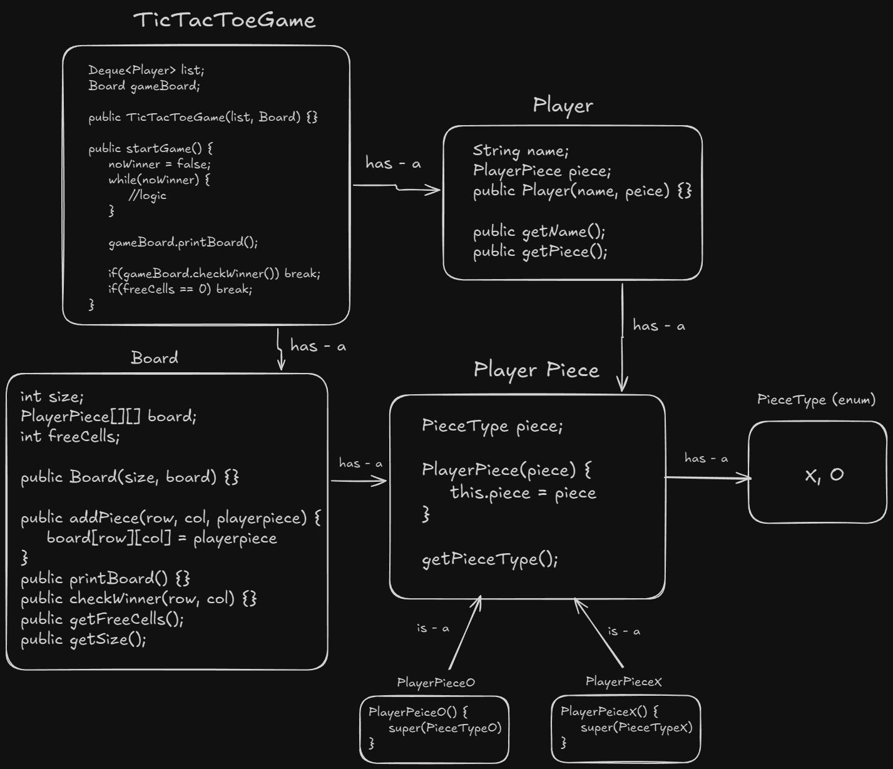

# Tic-Tac-Toe (Low-Level Design)

A scalable, object-oriented, and console-based implementation of the classic Tic-Tac-Toe game in Java. This project demonstrates core **Low-Level Design (LLD)** principles, focusing on clean code, loose coupling, and industry-standard design patterns.

  

## Key Features (Engineering Highlights)

This isn't just a game; it's a design demonstration prepared for SDE Interviews:

-   **Separation of Concerns:** Follows a modular structure separating **Models** (Data) from **Game Logic** (Controller).
-   **Dependency Injection:** The `TicTacToeGame` class receives `Players` and `Board` from the Client (`Main`), making the system loosely coupled and easy to test.
-   **Extensibility (Open/Closed Principle):** Uses `PlayerPiece` parent class with `PlayerPieceX` and `PlayerPieceO` subclasses. Adding a new piece type requires no changes to existing game logic.
-   **Optimized Winning Logic:** Instead of scanning the whole board (O(N^2)), it checks only the relevant row, column, and diagonals after every move (O(N)).
-   **Efficient Data Structures:** Uses `ArrayDeque` for efficient turn management (FIFO) and a `freeCells` counter for O(1) draw detection.
-   **Dynamic Scalability:** The board size is dynamic (supports NxN grids), not hardcoded to 3x3.

## Architecture & Class Diagram

The system follows a clear relationship between the Game Controller and Models.



## Project Structure

The project follows a package-based structure:

```text
TicTacToe/
├── Main.java                 # Client Code (Entry Point, Dependency Injection)
├── TicTacToeGame.java        # Controller (Game Flow, Turn Management)
└── models/                   # Data Layer
    ├── Board.java            # Grid Logic, Validation, Print, Winner Check
    ├── Player.java           # Player Attributes
    ├── PlayerPiece.java      # Parent Class for Pieces
    ├── PlayerPieceX.java     # Concrete Implementation X
    ├── PlayerPieceO.java     # Concrete Implementation O
    └── PieceType.java        # Enum (X, O)