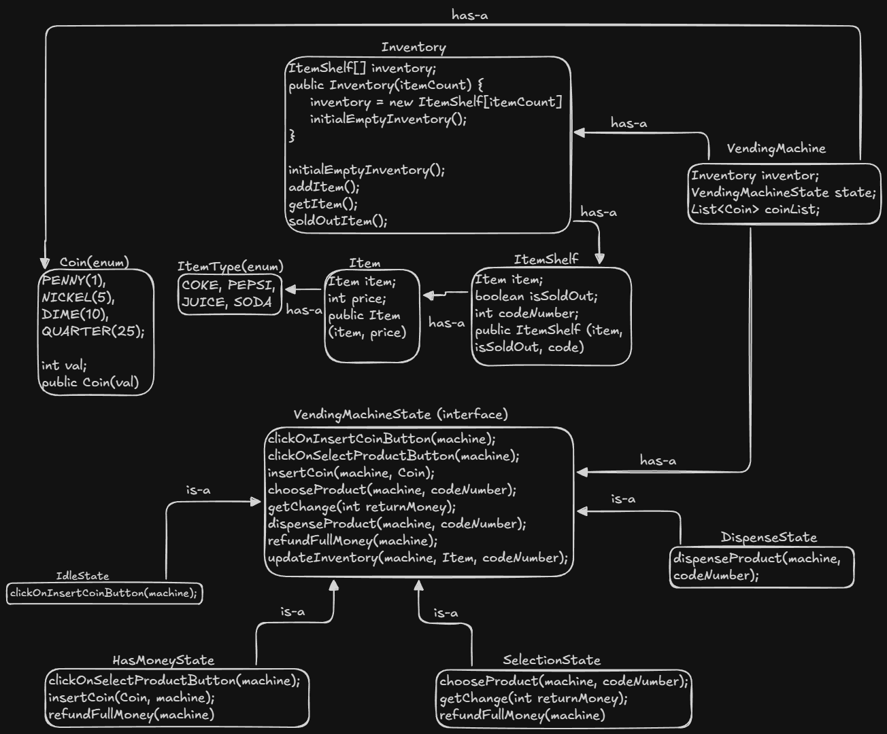

# Vending Machine - Low-Level Design

A robust, object-oriented implementation of a Vending Machine in Java. This project demonstrates the application of the **State Design Pattern** to manage complex machine behaviors, state transitions, and inventory management efficiently.

## Project Overview

This system simulates the end-to-end workflow of a physical vending machine, including:
* Inventory management (loading items into specific shelves).
* Coin insertion and balance tracking.
* Product selection and price validation.
* Dispensing logic with inventory updates.
* Automatic refunds for insufficient funds or cancellations.
* Change return logic after a successful purchase.

## Design Pattern: State Pattern

The core of this design relies on the **State Design Pattern**. Instead of using complex `if-else` or `switch` statements within the `VendingMachine` class to determine valid actions, the machine delegates behavior to specific State objects.

### Implemented States
1.  **IdleState**: The machine is waiting for a user. The only valid action is clicking "Insert Coin".
2.  **HasMoneyState**: The user has inserted coins. The machine accepts more coins or allows the user to select a product.
3.  **SelectionState**: The user has entered a product code. The machine validates the stock and price.
    * *Success*: Transitions to DispenseState.
    * *Failure (Insufficient Funds)*: Refunds money and returns to IdleState.
4.  **DispenseState**: The product is physically dispensed, inventory is updated (Sold Out logic), and any remaining change is returned to the user.

## Project Structure

The project is modularized into distinct packages to separate Data (Model), Logic (State), and Storage (Inventory).

```text
VendingMachine/
│
├── Main.java                 # Entry point (Simulation of User flow)
├── VendingMachine.java       # Context Class (Maintains State and Inventory)
│
├── docs/
│   └── VendingMachine_LLD_Architecture.png  # UML Class Diagram
│
├── inventory/
│   └── Inventory.java        # Manages the array of ItemShelves
│
├── model/                    # POJOs (Plain Old Java Objects)
│   ├── Coin.java             # Enum for Penny, Nickel, Dime, Quarter
│   ├── Item.java             # Product entity (Name, Price)
│   ├── ItemShelf.java        # Represents a physical slot (Code, Item, SoldOut status)
│   └── ItemType.java         # Enum for product names (Coke, Pepsi, etc.)
│
└── state/                    # State Pattern Logic
    ├── VendingMachineState.java  # Interface defining all possible machine actions
    ├── IdleState.java
    ├── HasMoneyState.java
    ├── SelectionState.java
    └── DispenseState.java
```

## Features

* **Immutable Inventory Identifiers**: Items are stored in specific "Shelves" mapped to unique code numbers (e.g., 101, 102).
* **Concurrency Handling (Simulation)**: The logic ensures an item is marked "Sold Out" only after a successful transaction validation.
* **Exception Handling**: Custom logic handles scenarios like invalid codes, sold-out items, or insufficient funds without crashing the application.
* **Scalability**: New states (e.g., `MaintenanceState` or `CardPaymentState`) can be added by implementing the `VendingMachineState` interface without modifying the existing codebase (Open/Closed Principle).

## How to Run

1.  Compile all Java files in the directory.
2.  Run the `Main` class.
3.  The console will output the step-by-step simulation of the state transitions, including:
    * Inventory Loading
    * Coin Insertion
    * State Changes (Idle -> HasMoney -> Selection -> Dispense)
    * Change Calculation

## Architecture Diagram

The system follows a strict **Has-A** (Composition) and **Is-A** (Inheritance) relationship model.

